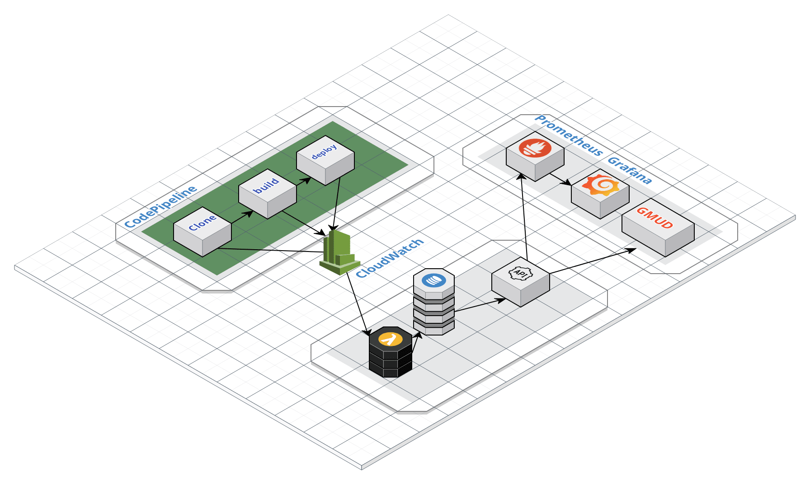

# Code-Metrics AWS

A proposta do Code-Metrics é obter métricas das utilização das ferramentas de pipelines da AWS, tais como `code-pipeline`, `code-build` e `code-deploy`. Além das métricas, também é disponibilizado a estrutura semática da pipeline com os `stages` que foram executados, muito oportuno para áreas como governança e auditória em gestão de mudança.

A solução do Code-Metrics envolve os seguintes recursos:

- **Lambda**: O Lambda recebe os logs da pipeline através de uma regra do cloud-watch, trata o log e armazena no `dynamodb`.
- **Api**: Disponibiliza os dados armazenados no `dynamodb`.

O desenho da solução basicamente é essa:

## Métricas

As métricas ofertadas são as seguintes:

## Code-metrics-Lambda

A [Lambda](code-metrics-lambda/code-metrics-lambda.py) desenvolvida em Python, recebe os JSON da `role` do cloudwatch, processa, estrutura e grava no dynamoDB.

Para saber mais sobre a estrutura que a pipeline é gravada, consulte a [documentação da Pipeline](doc/Lambda.md)

## Code-metrics-Api

API consome os dados gravados no DynamoDB e expõem os dados com as seguintes pontos de acessos:

| Route | Descrição |
|-------|-----------|
|/metrics|Saída das métricas no formato do [Prometheus](https://prometheus.io/)|
|/api/v1/pipelines|Saída estruturada de todas as pipelines|
|/api/v1/pipeline|Saída estruturada de uma pipeline|

[Para mais informação](docs/API.md) consulte a documentação.

## Code-metrics-cf

## Code-metrics-Dev

## Contribuindo

1. Primeiramente realize um `Fork` do projeto;
2. Crie sua feature branch: `git checkout -b my-new-feature`
3. Realize suas mudanças e faça os commits: `git commit -am "adicione a feature`
4. Realize o Push da branch:  `git push origin my-new-feature`
5. Envie o pull request
